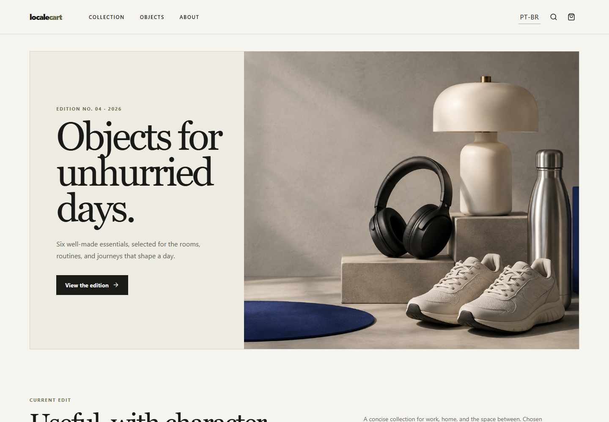
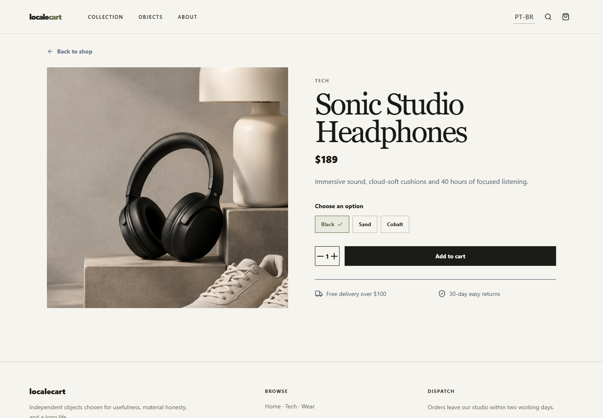

# LocaleCart UI

A modern bilingual ecommerce storefront built as a frontend portfolio project. LocaleCart offers a complete local catalog-to-confirmation demo with thoughtful responsive design.

## Highlights

- Editorial catalog with search, category filters and price sorting
- Product detail pages with variants and quantity selection
- Cart persisted in `localStorage`
- Validated demo checkout and order confirmation
- English and PT-BR interface toggle
- Responsive navigation and layouts

## Stack

React, Vite, TypeScript, React Router, Tailwind CSS and Lucide React.

## Run locally

```bash
npm install
npm run dev
```

Quality checks: `npm run lint`, `npm run typecheck`, and `npm run build`.

## Screenshots





Product imagery was created specifically for this demonstration. No payment data is transmitted or stored.
